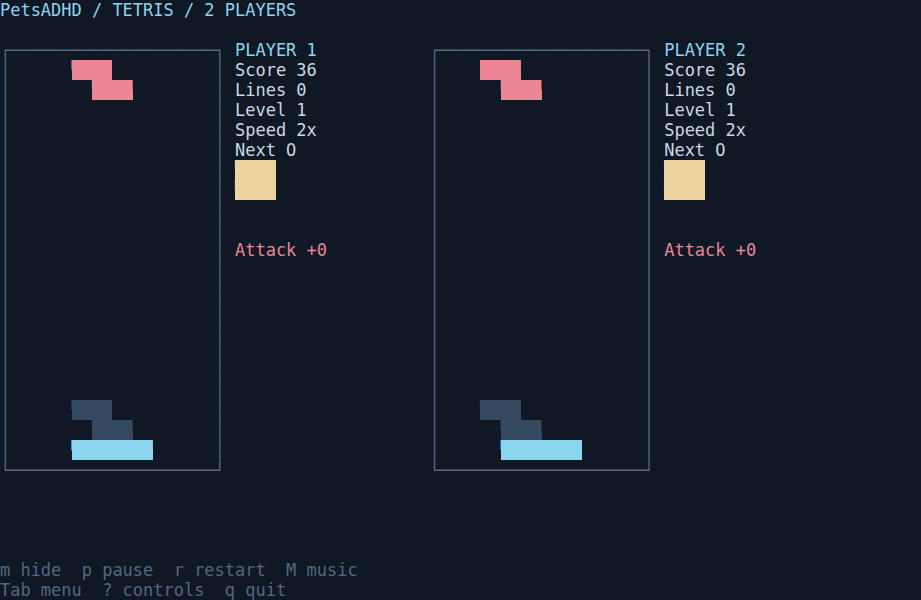
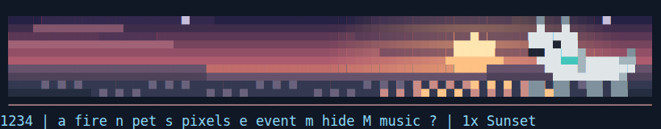
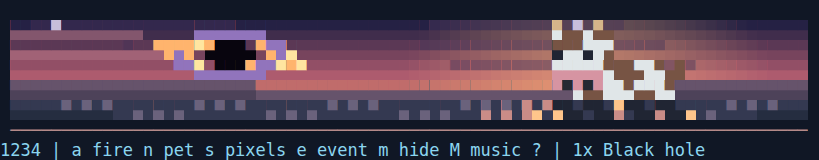
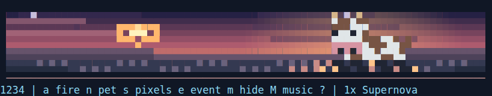

# PetsADHD for VS Code

Play pixel pets, Astra Tetris, shared-keyboard competitive Tetris, and Space
Invaders directly in VS Code's **integrated Terminal panel**. Dock it at the
bottom with right alignment by default; side docking is also available.



## Install and open

1. Download **PetsADHD-0.3.9.vsix** from the repository's `dist` folder.
2. Run **Extensions: Install from VSIX** and select the file. Reload VS Code if prompted.
3. Press **Ctrl+Alt+G** (**Cmd+Option+G** on macOS). A terminal named **PetsADHD**
   opens at the **bottom with right alignment**, gains focus, expands for play, and starts Tetris.
   If you already played a game, it resumes that game instead.
4. Press **Tab** for the arcade menu: **1** pets, **2** Tetris, **3** two-player Tetris, **4** Invaders.

You can also run **PetsADHD: Play Tetris**, **Play Competitive Tetris (2 Players)**,
**Play Space Invaders**, or **Show Tiny Pets** directly from the Command Palette.
VS Code 1.85 or newer is required. The extension is distributed as a VSIX and is
not published to the Marketplace.

### Keyboard shortcuts

| Action | Windows / Linux | macOS |
| --- | --- | --- |
| Open / resume the last game (Tetris on first use) | **Ctrl+Alt+G** | **Cmd+Option+G** |
| Open tiny pets | **Ctrl+Alt+P** | **Cmd+Option+P** |
| Hide and preserve the current game or pets | **m** inside the terminal | **m** inside the terminal |

Both opening shortcuts automatically create or reveal the game terminal, dock it
at the bottom with right alignment by default, focus it, and adjust its size. No shell command or manual
terminal creation is needed. The game shortcut remembers your last game even if
you switched to pets. A manually paused game stays paused; press **p** to resume.

Customize these shortcuts in **Keyboard Shortcuts** by searching for
**PetsADHD: Open / Resume Game** or **PetsADHD: Show Tiny Pets**.

## Panel position and size

Run **PetsADHD: Move Game Panel** and choose **Bottom Right**, **Bottom**, **Left**,
or **Right**. **Bottom Right** is the new default. If you previously saved another
position, choose Bottom Right once to replace that preference.

Bottom Right uses VS Code's bottom panel with right alignment. It still spans the
editor area and extends toward the right edge; it is not a separate floating
corner terminal. Docking affects the entire panel, including other terminals.
See VS Code's [panel layout controls](https://code.visualstudio.com/docs/configure/custom-layout#_panel).

**Pets are colored pixel art, at most five terminal lines tall.** Choose Rex,
**dog**, **cow**, duck, or readable 67 with **n**. The dog and cow have a blocky,
Minecraft-inspired look with original details: a teal dog collar and a distinct
cow coat pattern with a pink muzzle. Their menu names are simply **dog** and **cow**.

**s** changes the pixel size: **1× small/fine pixels** by default, or **2× chunky blocks**.
Each size uses a matching sprite design so the pets still fit within five lines.
The choice is remembered in this workspace. Set `petsadhd.pets.pixelSize` in VS Code
settings to change the preferred size. Pets never enlarge automatically when the
terminal is resized. This update adopts the small default for older saved
appearances; an explicit pixel-size setting still takes priority. Subsequent
changes with **s** are remembered.

Pets have a thin baseline and **one menu line**, with no separate title, status,
or extra control rows. The arcade chooser also uses a single line:

```text
1234 | a fire n pet s pixels e event m hide ? | 1x Sunset
```

Press **1–4** to switch directly between modes without losing game progress.
**a** breathes fire, **n** changes the pet, **s** changes pixel size, and **e**
summons a random space event. Labels shorten in narrow panels; **?** shows full
controls. The menu names the active event.

The sky is a **detailed sunset** with a violet-to-rose gradient, peach-lit cloud
ribbons, a glowing low sun, layered mountain silhouettes, and rippling water
reflections. Old night settings automatically adopt this scene.

Space events appear occasionally over the sunset: **black holes** with bright
accretion disks, expanding **supernova explosions**, **comets**, flowing **auroras**,
and ringed **Saturn**. Each lasts about seven seconds of active animation, with
quiet intervals between automatic events. Press **e** to summon one immediately.
The event sequence is randomized per workspace and preserved on reopening.

Pets walk across the available terminal width, turn to face their direction,
and animate their feet. The readable 67 keeps its numbers upright. **m** freezes
movement, fire and space events while hidden; reopening resumes them.







Opening pets adjusts the bottom panel toward **8 rows**, subject to VS Code's
minimum size and resize increments. Opening a game expands it toward **28 rows**.
Left/right panels use a width target of **28 columns** for pets and **72 columns**
for games. Switching modes through the menu also adjusts the size while preserving
games. Expansion stops at the available window space.

Optional VS Code settings:

```json
{
  "petsadhd.panel.position": "bottom-right",
  "petsadhd.pets.pixelSize": 1,
  "petsadhd.panel.autoSize": true,
  "petsadhd.panel.columns": 72,
  "petsadhd.panel.rows": 28
}
```

The columns/rows settings control the game size; pets use the compact targets
above. Set `petsadhd.panel.autoSize` to `false` to keep your manually chosen size.
You can also drag the panel edge during play; automatic fitting only runs when
opening or switching modes.

Graphics use colored Unicode block characters in a native pseudoterminal.
There are no webviews, browser pages, editor tabs, or canvas game surfaces.
Use a terminal font with block-character support; the normal monospace default works.

Tetris automatically switches between compact half-block pixels and larger
blocks. Competitive boards sit side by side in a wide panel and stack vertically
in a narrow side panel. Resizing preserves the board. Below the minimum size,
the game and audio suspend until the panel is enlarged.

| Mode | Minimum terminal size (columns × rows) |
| --- | --- |
| Pixel pets and one-line menu | 24 × 7 |
| Solo Tetris | 28 × 16 |
| Competitive Tetris, side by side | 56 × 16 |
| Competitive Tetris, stacked | 28 × 28 |
| Space Invaders | 68 × 18 |

## Controls

Click inside the PetsADHD terminal before playing. Press **?** for control help.

| Mode | Keys |
| --- | --- |
| All games | **p** pause, **r** restart, **m** minimize, **M** toggle music, **Tab** menu, **q** discard current game |
| Tetris | Arrows or **h/j/k/l** move, soft drop, rotate; **z** reverse rotate; **Space** hard drop; **+ / -** speed 1×–8× |
| Competitive P1 | **a/d** move, **s** soft drop, **w/g** rotate, **f** hard drop |
| Competitive P2 | **arrows** move/rotate/soft drop, **/** reverse rotate, **Enter** hard drop |
| Invaders | **Left/Right** or **h/l** move; **a** fires |
| Pets | **a** breathes fire; **n** cycles Rex, dog, cow, duck, 67; **s** changes pixel size; **e** summons a space event |

Two players share one keyboard, using lowercase letters for Player 1. Both get
identical pieces and speed. Clearing 2 / 3 / 4 rows sends 1 / 2 / 4 garbage rows
to the opponent. Incoming rows apply on the next piece lock and can be canceled
by your line clears. The first top-out loses. **+ / -** adjusts both speeds.

**m** hides the panel and freezes the game. Run the same game command or
**Open / Resume Arcade** to continue the same board. A manually paused game
stays paused until you press **p**. The menu also preserves each game's board.
Game state is saved in local workspace storage, including when the terminal is
closed; reopen it with a PetsADHD command. **q** explicitly discards only the
current game, and **r** restarts it.

Changing the active terminal, changing the active editor, or switching away from
the VS Code window suspends play. Reopening the arcade or pressing a game key
restores focus. Use **m** when hiding the panel: VS Code's public terminal API
does not report every panel-visibility or focus change.

## Optional music

Pets and games include default music. Press **M** to toggle it. You can change
the pet music in VS Code's Settings JSON:

```json
{
  "petsadhd.pets.musicUrl": "https://www.youtube.com/watch?v=YOUR_VIDEO_ID"
}
```

Use `petsadhd.tetris.musicUrl` for Tetris and competitive Tetris, or
`petsadhd.music.url` for Invaders. Audio requires `ffplay` (from FFmpeg), `yt-dlp[default]`, a
supported JS runtime, network access, and a working audio device. Node.js is
explicitly enabled; Deno is also supported by yt-dlp. No tools install
automatically and no music files are bundled.

The Neovim private environment at `~/.local/share/nvim/invaders-audio/bin/yt-dlp`
is reused if present; otherwise `yt-dlp` is found on PATH. Set
`petsadhd.music.extractor` to override it. Settings also expose volume, default
music enablement, and initial Tetris speed.

Minimizing pauses the soundtrack and resumes it when reopened on Linux/macOS.
Windows restarts playback when resuming. Closing the terminal stops audio.
Audio runs only in trusted workspaces, on the extension host machine (the remote
machine when using remote VS Code). Missing audio dependencies leave games playable.

## Development

```sh
npm ci
npm test
npm run package
```

Open this `vscode` directory and press F5 to launch an Extension Development Host.
The Node tests cover the game engine, audio lifecycle, mocked VS Code terminal
API, save/resume, docking commands, resizing, and ANSI output parsed by xterm.
An optional visual test renders that same ANSI stream using xterm in Chromium:

```sh
PETSADHD_CHROMIUM=/path/to/chromium node test/browser.cjs
```

The browser is only a test harness and is excluded from the extension package.
The preview above shows that terminal renderer. Game state is stored locally;
there is no telemetry. MIT covers the code; external music is not included in it.
